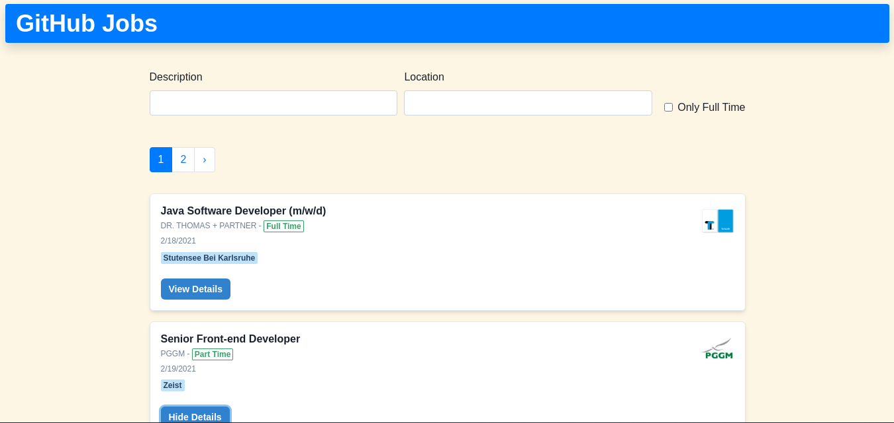
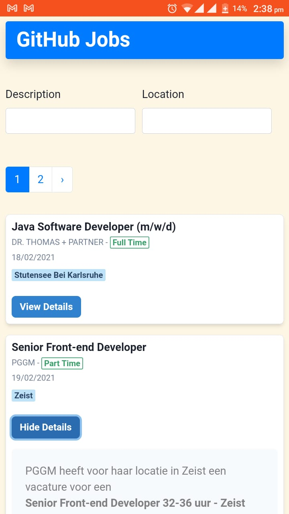

This is a [Next.js](https://nextjs.org/) project that consumes the [GitHub Jobs API](https://jobs.github.com/api).

## Tech Stack

- [Next.js](https://nextjs.org/)
- [Chakra-UI](https://chakra-ui.com/)
- [React Hooks](https://reactjs.org/docs/hooks-intro.html)
- [React-Bootstrap](https://react-bootstrap.github.io/)
- [Axios](https://github.com/axios/axios)

## Running the project locally

First, clone the repo and install the dependancies:

```bash
npm install
# or
yarn
```

Then, run the development server:

```bash
npm run dev
# or
yarn dev
```

Open [http://localhost:3000](http://localhost:3000) with your browser to see the result.

## Deploy on Vercel

The project is deployed using the [Vercel Platform](https://vercel.com).

## Screenshots

### Desktop



### Mobile


